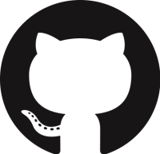

# Sugar Labs @GSoC

## Shortcuts

|[GSoC Ideas Page](Ideas-2019.md)| [Application Template](Template.md) | [Sugar Labs @GitHub](https://github.com/sugarlabs) | [Sugar Labs @IRC](https://webchat.freenode.net) |
|:-------------------------:|----------------------|----------------------|--------------------------|
| |  |  | |

## Introduction
Google Summer of Code is a *global program focused on bringing more student developers into open source software development*. Sugar Labs will be applying in Google Summer of Code 2019 as a mentor organisation. See [GSoC 2019 timeline](https://developers.google.com/open-source/gsoc/timeline?hl=vi) for more details

Here is an archive of Sugar Labs @GSoC: [2009](https://wiki.sugarlabs.org/go/Summer_of_Code/2009) | [2010](https://wiki.sugarlabs.org/go/Summer_of_Code/2010) | [2011](https://wiki.sugarlabs.org/go/Summer_of_Code/2011) | [2012](https://wiki.sugarlabs.org/go/Summer_of_Code/2012) | [2013](https://wiki.sugarlabs.org/go/Summer_of_Code/2013) | [2014](https://wiki.sugarlabs.org/go/Summer_of_Code/2009) | [2015](https://wiki.sugarlabs.org/go/Summer_of_Code/2015) | [2016](https://wiki.sugarlabs.org/go/Summer_of_Code/2009) | [2017](https://wiki.sugarlabs.org/go/Summer_of_Code/2017) | [2018](https://wiki.sugarlabs.org/go/Summer_of_Code/2009)

## Want to Apply ?
Thank you for showing your interest in working with us for the summer. 
We have a lot of interesting project ideas for you. There is Sugar OS, Sugar Activities, Music Blocks and Sugarizer. You can start by going through them to see what would you like to work on. After that, you can go through our [Ideas](Ideas-2019.md) page to see our proposed ideas. We would love to hear your own ideas which can make an impact to Sugar Labs.

You should familiarise yourself with our code. The best way to do so is by contributing to our code. This will assure us that you will be able to work on the project ;-)

## Community etiquette
It goes without saying that everyone in the community has to be polite and respectful, and consider everyone else a member of a team and not a competitor.

One should be consierate to everyone else's time. We would like to have quality discussions, and not answer questions that are already documented, or the ones available on stackoverflow. This doesn't mean you can't ask questions, but remember that being a clueless user and a lazy developer are two very different things.

Tell things as you see them. Be Polite, but don't sugar-coat it. We know some parts of our code is poorly written, poorly documented, etc. We'd be happy to have them rewritten / refactored.

Also see our [Code of Conduct](https://github.com/sugarlabs/sugar-docs/blob/master/src/CODE_OF_CONDUCT.md)
